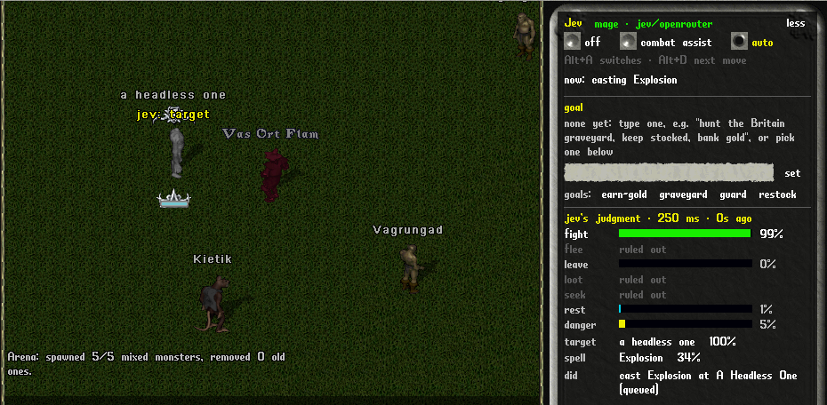
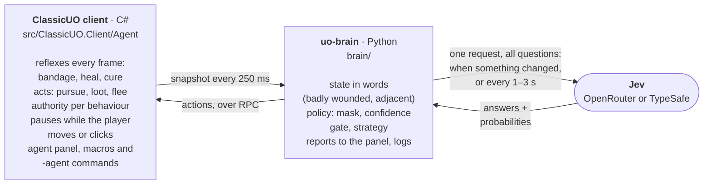

<h1 align="center">ClassicUO with a Jev agent</h1>

<p align="center">
  <b>An AI agent inside the Ultima Online client.</b><br>
  It fights beside you, or plays on its own towards a goal you give it in words.
</p>

<p align="center">
  
  
  
  
  <a href="LICENSE.md"></a>
</p>

<p align="center">
  <a href="#quick-start">Quick start</a> ·
  <a href="#how-it-works">How it works</a> ·
  <a href="#playing-with-the-agent">Playing</a> ·
  <a href="#goals-and-the-planner">Goals</a> ·
  <a href="#results">Results</a> ·
  <a href="#reference">Reference</a>
</p>

<p align="center">
  
  <br>
  <sub>A test mage in the arena on auto. Jev picked the headless one ("jev: target") and Explosion; the panel shows its judgment, answered in 250 ms.</sub>
</p>

This fork of [ClassicUO](https://github.com/ClassicUO/ClassicUO) adds an AI agent that can
play alongside you or play on its own. Decisions come from [Jev](https://docs.typesafe.ai),
TypeSafe's "System One" model, which answers typed questions (pick one of these options, yes
or no, rate this) with probabilities in about 100 ms. Ordinary code does everything that has
a right answer: healing thresholds, pathfinding, looting mechanics, safety rules.

| Feature | What it does |
|---|---|
| **Combat assist** | You drive. It fights beside you, keeps you healed, and does Jev's next move on a key. [Play states](#play-states-and-keys) |
| **Auto, towards a goal** | "Hunt the undead at the Britain graveyard, bank the gold": a planner model (Claude Sonnet) chooses each step (travel, hunt, bank, buy, sell) and Jev fights. [Goals](#goals-and-the-planner) |
| **Character types** | Warriors, mages, archers, tamers and bards, and two hybrids, told apart from the skills. [Character types](#character-types) |
| **Strategy in your words** | "Never flee, finish the weakest first": Jev weighs it in every decision, and code enforces what it compiles to. [Strategy](#strategy-in-your-own-words) |
| **The agent panel** | What Jev is thinking, in game: its probabilities, choices and actions for every decision. [Panel](#the-agent-panel) |
| **World knowledge** | Places, spawns, creatures, routes and past hunts for each shard, with Jev picking the facts that matter. [World knowledge](#world-knowledge) |
| **Measured** | A judgment benchmark measures where Jev beats fixed rules, with scenarios built so the obvious rule gets them wrong. [Results](#judgment-benchmark) |

> [!NOTE]
> **Status:** works end to end against a local ModernUO server with Jev deciding through
> OpenRouter, for all of the character types. Not yet tried on a public shard.

## Quick start

You need macOS on Apple Silicon, the .NET 10 SDK, the Xcode command line tools (NativeAOT
links with clang), [uv](https://docs.astral.sh/uv/) (the brain needs Python 3.13 or later)
and an OpenRouter key, which Jev and the planner share. No Windows machine is needed.

```bash
# 1. Build the client
git submodule update --init --recursive
dotnet publish src/ClassicUO.Client/ClassicUO.Client.csproj -c Release -r osx-arm64 -o bin/osx-arm64

# 2. Game files: the official UO client, straight from EA's patch servers
python3 tools/uo-download/download_uo.py --out ~/Workspace/UOClassic

# 3. Local test server (ModernUO in ~/Workspace/ModernUO; setup in tools/modernuo/README.md)
~/Workspace/ModernUO/start-agent-server.sh

# 4. Model key, saved to brain/.env (gitignored). OpenRouter is used when present.
#    Or skip this: copy the key and click "paste key" in the agent panel.
brain/set-openrouter-key.sh          # prompts without echoing; or: pbpaste | brain/set-openrouter-key.sh

# 5. Play. Run the client from its folder: settings.json is read from the current directory.
cd brain && uv sync && cd ..
(cd bin/osx-arm64 && ./cuo -agent_port 5577 &)
```

> [!IMPORTANT]
> The first launch writes `bin/osx-arm64/settings.json` and stops, because it has no client
> version yet. Set these, then launch again:
>
> ```json
> "ultimaonlinedirectory": "/Users/<you>/Workspace/UOClassic",
> "clientversion": "7.0.117.1",
> "plugins": []
> ```

Accounts on the test server are created on first login (`admin`/`admin` is the owner). In
game, **Alt+A** or the panel turns the agent on, and that starts the brain for you.

### Driving it from a terminal

Instead of the panel, e.g. for the arena:

```bash
cd brain
uv run uo-brain login --account warrior --password warrior --create-warrior Brutus
uv run uo-brain say "[AgentGo"; uv run uo-brain say "[AgentKit"; uv run uo-brain say "[AgentArena 6"
uv run uo-brain run --mode auto --log logs/run.jsonl

# Or a mage, with a ready-made strategy
uv run uo-brain say "[AgentKit mage"; uv run uo-brain strategy template nuker
uv run uo-brain scenario --kit mage --monsters 4 --log logs/mage.jsonl
```

With no model key, `--judge heuristic` runs the same loop on fixed rules (the baseline). The
`[Agent…` commands come from the test server ([list](#test-server-commands)).

### The client starts the brain

When the agent is turned on and nothing is connected to
its port, the client runs `uv run uo-brain run` in the repository's `brain/` folder,
restarts it if it exits (waiting longer each time), and stops it when the agent is turned
off or the client closes. Its output goes to `brain/logs/client-brain.log`, its decisions
to `brain/logs/auto-<date>.jsonl`. A brain you start in a terminal takes precedence. In
settings.json, `agent_start_brain: false` turns this off (or `-agent_start_brain false`),
and `agent_brain_dir` points at a brain folder elsewhere. The *paste key* link saves the
clipboard to `brain/.env` (mode 600) and restarts the brain; the key is never shown.

**Razor and other plugins:** `scripts/build-naot.sh` builds upstream's release layout instead (osx-x64, the client as a
library loaded by the net472 `ClassicUO.Bootstrap` host). That is only needed for managed
assistant plugins such as Razor.

## How it works



1. **The client snapshot** gives the player, the creatures and corpses within 18
   tiles, new journal lines and the agent's own state.
2. **The brain describes the situation in words.** Jev reads "badly wounded,
   adjacent, to the east" far more reliably than raw numbers and coordinates. How
   strong each creature is comes from its stats in the world store ("an ogre lord, far
   stronger than you: do not fight it alone", "a spellcaster"), and supplies are worded
   too ("running low: 12 bandages and 1 heal potion left").
   Candidates get short ids (`t1`, `c1`, `i1`) so the model can only pick things
   code has already checked. Other players' speech is never sent to the model.
   Up to three facts from the world store that Jev picked for this place go in as
   `what_you_know_about_this_place` ([below](#which-facts-reach-the-decisions)).
3. **One Jev request asks every question that could matter**:
   - `intent`: fight, flee (for a moment), leave (the area: run until nothing is in sight), loot, seek or rest
   - `in_danger`: will the character die soon if it keeps fighting?
   - `leave_now`, only when there's a reason to (a far stronger creature within 12 tiles, supplies nearly gone with two or more creatures close, or picked world facts with a creature in view): should it leave now? Jev judges this better as its own yes/no than as one of six intents: with an ogre lord adjacent it still gave fight 80%.
   - `target`: which creature to attack
   - `spell` (mages): which attack spell to cast next
   - `corpse`: which corpse to loot first
   - `take_iN`: is this item worth picking up?

   Code uses the answers that apply and ignores the rest.
4. **The policy is code.** It masks options the facts rule out (no looting with a
   monster adjacent), requires the intent and the danger judgment to agree before
   fleeing, keeps its current course when confidence is low, and applies your
   strategy settings.
5. **The client has the last word.** It checks the behaviour's authority before
   anything happens, and the brain may only ever attack monsters.

## Playing with the agent

### Play states and keys

There are two ways to play, and one key between them:

- **Combat assist:** you drive. The agent fights alongside you and never walks the character.
- **Auto:** the agent plays on its own.
- **Off:** nothing runs.

**Alt+A** switches between combat assist and auto (from off it starts combat assist), and
**Alt+D** does Jev's next move. Both are ordinary macros (*Agent: switch* and *Agent: next
move*) added once per character; rebind or delete them in Options → Macros. A key you
already use is left alone, and the macro is added without a key.

**Combat assist** follows your target: it attacks, or casts at, whatever you attacked or
targeted. A setting chooses what else it takes on by itself (`-agent engage`, or the
*engages* row in the panel):

| setting | it engages |
|---|---|
| `follow` | only what you attack |
| `defend` (default) | that, and anything attacking you |
| `nearby` | any monster within 8 tiles |

- **A warrior** keeps swinging and bandages between hits; this works with no brain running.
- **A mage** casts the next spell from your strategy, or Jev's pick, at your target, and says above your head when the target is out of spell range.
- **It never walks or flees for you:** when Jev judges the fight is going badly, it says so ("this fight is going badly, get out") and leaves the moving to you.
- **On your key:** set *fights* to *on your key* (`-agent set fight suggest`) and Jev only picks the move; Alt+D does it.

**The next-move key** (Alt+D, `-agent next`) does Jev's pending suggestion if there is one,
otherwise the combat move from its latest decision (a cast, a target switch), otherwise a
bandage if you're hurt. You decide when, Jev decides what.

**Auto** is fully autonomous play. Give it a goal and it works towards it
([Goals and the planner](#goals-and-the-planner)).

**Handing over control:**
- **In auto,** moving, clicking in the world or using the arrow keys is a short override: control comes back to you for 4 seconds, any walk the agent started stops, and only the healing reflexes keep running. The Alt+A key is the real switch.
- **In combat assist,** your input only pauses the agent's own movement (looting a corpse, if you accepted it). The fight goes on while you walk, and a spell it is casting still goes off at its target unless you clicked in the world.
- **Your target sticks:** if you attack a different monster yourself, the agent follows your choice.
- **Your spell cursors are yours:** if you click in the world while one of the agent's attack spells is being cast, its target cursor is left to you.
- **Panel clicks don't count:** clicking the panel doesn't pause the agent.

The hand-back and the keys were checked with real mouse and keyboard events ([results](#real-input)).

**Authority per behaviour.** Each behaviour has its own authority: `off`, `suggest` or
`auto`. The play states are presets:

| state | heal / cure / potion | fight | loot / misc | move |
|---|---|---|---|---|
| `off` | off | off | off | off |
| combat assist (`assist`) | auto | auto | suggest | off |
| `auto` | auto | auto | auto | auto |

- **Overrides:** change any single behaviour, e.g. `-agent set fight suggest` while in combat assist.
- **Behaviours:** `heal` (bandages), `cure` (cure potions), `potion` (heal potions), `fight`, `loot`, `move`, `misc`.
- **Saving:** settings are saved per character. A character saved in the old assist mode starts in combat assist.

### The agent panel

Jev's thinking is shown inside the game, in a UO-style panel that opens beside the game view
whenever the agent is on or a brain is connected. It shows:

- **Play state buttons:** off, combat assist and auto, with the keys that switch between them and do Jev's next move.
- **Combat assist settings:** what it engages (your target, also attackers, or anything near) and whether it fights on its own or waits for your next-move key.
- **The goal** (auto mode): what you asked for, the step the planner is on and why, *pause*/*resume* and *clear*, an entry box, and the goal templates (see [Goals and the planner](#goals-and-the-planner)).
- **The brain's state** in the title row ("brain starting", "brain running"), and a *paste key* link while there is no model key.
- **Watch out:** a red, criminal or unknown player within 8 tiles.
- **What the agent is doing:** for example "fighting Vorgak", "casting Explosion" or "bandaging", and "you're driving" or "you have the controls" while you're playing.
- **Jev's judgment** for the latest decision:
  - a bar for each intent with Jev's probability, plus options the facts ruled out;
  - the danger judgment;
  - the target and spell it picked, with confidence, or "your strategy" when your strategy chose the spell;
  - what was done, and the latency.
- **A pending suggestion** with an *accept* link.
- **Your strategy and how Jev read it**, an entry box to add a line, and the template links (see [Templates](#templates)).
- **Earlier decisions**, with repeats collapsed ("fight an orc x5").
- **Kills, deaths, heals and casts.**

When Jev picks a new target, "jev: target" appears above that creature in the world. *less*
collapses the panel to a few lines; its position and whether it is collapsed are saved per character.

### Reflexes

The client runs these without the brain:

- **Bandages:** bandage yourself below 85% health, or when poisoned.
- **Heal potion:** drink one below 40%, with the 10-second cooldown respected.
- **Cure potion:** drink one when poisoned and hurt.
- **Healing spells** (characters with no bandages): Heal below 65%, Greater Heal below 50%, and Cure when poisoned if no cure potion is ready.

Adjust them with `-agent bandage 80` and `-agent potion 35`. They're also
available on their own: combat assist with no brain running heals you and keeps a warrior swinging.

### Safety rules

These are in code, whatever the model says:

- The brain only attacks monsters: grey or red, not human, not a pet.
- Other players' speech goes to neither the model nor the reflexes.
- Actions are a fixed list.
- Gold, bandages and potions are always taken; anything else needs a "worth taking" judgment.
- Other players are never attacked, never named to the model (they appear as "a red player", "a criminal player" or "another player") and never named in the world store.
- The brain only loots corpses of creatures the client saw die as monsters. Taking from anything else (an animal, a townsperson, another player) can be a crime: in a test, looting a rabbit's corpse in Britain made the character a criminal and the guards killed him.

### Other players

The client watches for other players within 8 tiles: **red** (murderers), **criminals**,
and **unknown** players, meaning people without an NPC title ("Lucy the healer"). Titles come
from item properties, or, on shards without them (pre-AOS), from one single click per
person; until a title is known, only red and criminal players are flagged.

- **Combat assist:** a warning above their head, in the panel and in the journal, once a minute per player.
- **Auto:** it leaves: a red or criminal player within range makes the character run 15 tiles away from them, and a hunt ends ("a red or criminal player came close") so the planner can choose somewhere else.
- **Defensive only:** the agent never attacks a player, whatever the mode.
- **The world store** notes "A red player was seen here." for the area, never who.

## Character types

The brain tells how to play a character from its skills and what it has in hand, checking in
this order, or you name it with `uo-brain run --archetype warrior|mage|archer|tamer|bard`:

| plays as | when |
|---|---|
| mage-tamer | a spellbook, and Magery and Animal Taming both 50 or more |
| warrior-mage | a spellbook, Magery and a weapon skill both 50 or more, and a melee weapon in hand |
| mage | a spellbook, Magery 50 or more and at least as high as any weapon skill |
| tamer | Animal Taming 50 or more, and at least as high as any weapon skill |
| bard | Musicianship 50 or more, and a bard skill 50 or more and at least as high as any weapon skill |
| archer | a bow or crossbow in hand |
| warrior | anything else: melee, bandaging between hits |

### Mages

- **Range:** it engages from up to 7 tiles away and casts Jev's pick from the attack spells it can cast right now: Flamestrike, Energy Bolt, Explosion, Lightning, Mind Blast, Fireball, Harm, Magic Arrow, Poison and Paralyze.
- **Your spell plan comes first:** the opener on a fresh creature, then the main spell. Jev picks when your strategy names none; code picks the strongest castable spell when Jev isn't sure.
- **Queued casts:** the brain queues the next spell and the client casts it the moment the current spell and its recovery allow. Healing reflexes go first.
- **Protection:** with a monster in melee reach it casts Protection first, since every hit otherwise interrupts a spell. That's AOS: on older shards Protection only adds armour, so it's skipped (see [Older rules](#older-rules-pre-aos-shards-such-as-uo-renaissance)). Some servers send no buff icon for it, so it is recast at most every 20 seconds.
- **Kiting:** with two or more monsters in melee reach it steps back 5 tiles between spells, keeping its target; the next spell waits for the step, since casting roots the mage. It steps back once per attack spell cast: stepping back again before a spell went off kept one test mage from ever casting.
- **Meditation:** it meditates while resting with mana below 80%.
- **Seeing inside:** the server only says what's in a spellbook or a bag once it's opened, so the agent opens the spellbook and any unopened bags in the backpack once, and closes them again.
- **Snapshot:** mana, reagent counts, every spell in the book with its cost and why it can't be cast ("mana", "reagents"), and the cast timing.

### Archers

- **Range:** it engages from up to 8 tiles, or the weapon's own range if shorter (a bow reaches 10, a crossbow 8, a repeating crossbow 7), and the client keeps that distance while it shoots.
- **Ammunition:** the snapshot counts arrows and bolts and says which the weapon in hand needs. With none left it can't fight, so fighting is ruled out and it leaves. At 25 or fewer the supplies read "running low", and an empty quiver ends a hunt. A hit leaves some arrows in the monster's pack, so the client takes arrows and bolts from corpses as it does gold and bandages.
- **Kiting:** with two or more monsters in melee reach it steps back 5 tiles, once per shot fired (counted by arrows used), since a bow fires only once the archer has stood still for a moment.
- **Restocking:** the planner knows an archer wants 150 arrows or bolts, and `do buy arrow 200` finds a bowyer or provisioner in the world store.

### Tamers

The pet fights and the tamer stays back.

- **Finding the pet:** a pet looks like any other blue creature; only its status says the owner may rename it. The client asks the server for the status of each non-hostile creature in sight, once a minute, and lists the pets in the snapshot with their health.
- **Orders:** the `pet` verb says what a player would: `all kill` (the client answers the target cursor with the creature), `all follow me`, `all guard me`, `all stay`. The brain only sets a pet on monsters.
- **Fighting:** Jev picks the creature to set the pet on; anything attacking the tamer itself comes first.
- **Looking after the pet:** below 70% health, the tamer bandages it when it's within 2 tiles (Veterinary), or walks over when it's further off. It also walks back to a pet more than 7 tiles away, since a pet out of sight is lost.
- **Calling it back:** when the pet is losing, Jev is asked on its own whether to call it back ("the pet is badly wounded (45%), fighting an orc"). A yes at 0.6 or more, or the pet under 20%, sends `all follow me` and runs 8 tiles. When leaving, the tamer goes in short legs, calls the pet every few seconds and waits for it to catch up. Without a pet in sight it can't fight, so it leaves.
- **In combat assist** it says "call your pet back, it is losing" instead of moving.

### Bards

A bard fights with songs.

- **The songs:** provocation sets one monster on another; peacemaking calms one (aimed at the bard itself, it calms everyone around); discordance weakens one. Each is a skill use followed by target cursors. The `skill` verb takes `targets`, and the client answers each cursor in turn. If the server first asks "What instrument shall you play?", the client answers with an instrument from the pack.
- **Choosing:** Jev picks the song and the creature. For provocation it also picks whom the incited creature should attack. When Jev isn't sure, code incites the strongest against another if there are two, calms one that is close, and otherwise weakens it.
- **Pacing:** one song every 6 seconds, and a creature a song has just hit is left alone for 20.
- **No instrument, no fight:** the bard leaves instead.

### Hybrids

- **Mage-tamer:** sets the pet on the creature, casts at it from range as a mage does, and heals the pet with Greater Heal from up to 10 tiles away. It asks both the spell and the pull-back questions.
- **Warrior-mage:** opens with one spell on a creature that is still 2 to 7 tiles off, then fights in melee. ModernUO, like other RunUO-family servers, drops the weapon into the pack when a spell starts, so after each cast the client lifts it and puts it back on, as an assistant's arm macro does.
- **Not done:** Necromancy and Chivalry, which only AOS-era shards have.

## Strategy, in your own words

You can tell the agent how you like to play, like an `AGENTS.md` for your character:

```
-agent strategy set Attack relentlessly and never flee.
-agent strategy add Finish off the weakest enemy first. Only pick up valuable things.
-agent strategy            (shows it)
-agent strategy clear
```

From the command line: `uo-brain strategy load my-warrior.md`, or `uo-brain run --strategy my-warrior.md`.

The strategy is saved per character and used in two ways:

- **As context:** the text goes into every decision question (intent, target,
  corpse, items), so Jev weighs it each time it chooses. It is kept out of the
  `in_danger` question, which is a factual judgment.
- **As settings:** when the text changes, Jev answers typed questions about the
  strategy itself, and code enforces the answers:

  | question | type | effect |
  |---|---|---|
  | Does it allow fleeing? | yes/no | Turns fleeing off entirely, including the code's own emergency flee |
  | How aggressive? | 5-level score | Moves the danger threshold for fleeing |
  | Which target first? | choice | Current / weakest / closest / strongest when Jev isn't sure |
  | How much to loot? | choice | Everything / valuables / nothing |
  | Which spell to open with? | choice | Mages cast it first at each new creature |
  | Which spell after that? | choice | Mages keep casting it once the fight is under way |

`uo-brain strategy explain` shows how the current text was read, and the panel shows the
reading under your strategy. Spell plans are settings as well as context because the text
alone wasn't enough ([results](#arena)).

### Templates

Ready-made strategies you can pull in instead of writing your own, and combine with your own lines:

| template | for | what it says |
|---|---|---|
| `relentless` | any | Never flee, press the attack, finish the weakest first, take only valuables |
| `survivor` | any | Play it safe, retreat early, fight what's closest |
| `farmer` | any | Clear everything nearby, loot every corpse completely |
| `champion` | any | Go for the most dangerous enemy first, aggressively |
| `no-loot` | any | Never stop to loot |
| `nuker` | mage | Open with Explosion, then keep casting Energy Bolt |
| `mana-saver` | mage | Open with Lightning, then cheap Magic Arrows; rest between fights |
| `flamestriker` | mage | Open with Flamestrike on the most dangerous enemy, finish with Lightning |

- **Pulling one in:** click it in the panel's *templates* row (hover for the full text; click a gold one to take it out). Or use `-agent template nuker`, or `uo-brain strategy template nuker`.
- **Adding to or replacing your strategy:** a template is added after your own lines; use `set` / `--replace` to start over from it. `-agent template` lists them.
- **Your own templates:** drop a `.md` file into an `AgentTemplates` folder next to the client. A file with the same name as a built-in one replaces it. The format is:

  ```
  # Title
  for: warrior | mage | any
  summary: one line for lists and tooltips

  One instruction per line.
  ```

Jev reads all eight built-in templates as intended: every flee, target, loot and spell
setting matches, tested by compiling each one with Jev and with the rule judge.

## Goals and the planner

In auto mode the agent can work towards a goal you give it in words, for example "hunt
the undead at the Britain graveyard, keep yourself supplied with bandages, bank your
gold". Type it into the panel's goal box, pick a goal template, or use `-agent goal`.

- **The planner** is a larger model (Claude Sonnet 5.5 through OpenRouter, the same key as Jev). Each time a goal ends, it sees the character's situation in words, your goal and what has happened so far, and answers with one tool call: a goal for code to carry out (`travel_to`, `hunt`, `bank`, `buy`, `sell`, `rest`, `set_strategy`, `finish`) or a world-store query first (`place`, `find_place`, `hunting_spots`, `what_spawns`, `route`, `notes`, `outcomes`, `region_at`). Jev re-ranks the list answers against the planner's question ([below](#which-facts-reach-the-decisions)); the session summary counts those calls and their cost.
- **No scripted loop:** the planner puts travel, hunting, banking and restocking together itself. Code carries out each goal ([below](#travel-banking-shops-and-hunting)); Jev keeps the fighting.
- **Routine calls are Jev's:** inside a hunt, whether to head back, stay or walk elsewhere in the spawn are quick Jev questions, not fixed thresholds and not planner calls ([Hunting](#travel-banking-shops-and-hunting)). The planner is called when a goal ends, including when Jev is unsure twice running, so open-ended choices (where next, what to buy) stay with it.
- **Cheap to call:** each step rebuilds a short prompt (a cached system prompt, the goal, the last 12 steps, the character now) instead of growing one long conversation. A call costs about $0.014.
- **The panel** shows the step and why ("hunting at Britain Graveyard for up to 15 min: supplied with 80 bandages; time to hunt"). *pause* keeps the goal but stops work on it.
- **Handing over:** switching to combat assist (Alt+A) stops the agent walking at once and pauses the planner, so it stops costing tokens. Switching back to auto tells the planner you drove for a while, and it resumes from wherever the character is, with whatever it carries.
- **Danger seen on the way:** every goal's result names the stronger creatures seen during it, and they are kept in the world store as "danger" notes that the planner's `hunting_spots` shows for the area.
- **Finishing:** when the planner calls `finish`, or the character dies, the goal is paused with the reason.

Goal templates (`-agent goal templates`, or the *goals* row in the panel):

| template | goal |
|---|---|
| `graveyard` | hunt the undead at the Britain graveyard from the West Britain bank; restock and bank |
| `earn-gold` | pick hunting spots near Britain that suit the character, keep supplied, bank the gold |
| `guard` | stay where you are, fight what comes near, rest in between |
| `restock` | bank gold and loot, buy supplies for a long hunt, then stop |

Your own go in an `AgentGoals` folder next to the client, in the same format as strategy
templates.

From the command line, `uo-brain session "GOAL" --hours 1 --log logs/session.jsonl` runs
the planner without the panel; `uo-brain run` does the same whenever the panel has a goal
and the agent is in auto mode. How an hour with nobody at the keyboard went:
[Unattended runs](#unattended-runs).

### Travel, banking, shops and hunting

Real play is a loop of travelling, hunting, banking and restocking. Each step is one
goal that code carries out, using the world store for places:

- **Travel** walks to a named place or a tile across the map. The client's own pathfinder
  only sees about a screen, so the walk is planned coarsely over the map and static tiles
  (`AgentNav`), then walked a leg of up to 16 tiles at a time with that pathfinder, which
  handles creatures, items and the exact movement rules. Roofs don't count as ground.
  - **Doors** are items, not map tiles, so the plan treats a doorway as open; when a leg won't plan, the walker opens a closed door standing on the path.
  - **Stuck:** no progress for 8 seconds counts as stuck. The walker tries a door, then blocks that stretch and plans again (up to 5 times), in a wider box when the way round leaves the first one. Impassable items seen on the way (barricades, blockers) stay blocked for the rest of the trip.
  - **On the way** the brain fights only what comes close or attacks, and doesn't seek or loot. The same goes for resting, banking and shopping: every goal other than a hunt runs with Jev fighting beside it in this defend-only way. A soak run found the gap: a character resting at the graveyard was killed by a lich, with nothing fighting back.
  - Each walk goes into the world store as a route, with the spots where it got stuck.
- **Recall and Gate Travel:** on trips over 40 tiles, travel first looks for a marked rune or a runebook entry that goes there (by name, or by a name the world store places within 20 tiles), recalls (a mage casts Recall; anyone else uses a runebook charge), then walks the rest. A failed cast is tried once more, then it walks. The client reads each runebook once through its gump, without showing it, and answers the gump's entry button to recall or open a gate; a moongate's "dost thou wish to step in" warning is answered too. Gate Travel is there for the planner and the CLI (`act recall … kind=gate`, then use the gate).
- **Banking** (`bank`): says "bank" near a banker and moves items one at a time, checking each arrives (the server refuses moves that come too fast). Deposit `gold`, `loot` (anything that isn't kit or supplies) or named items (`bandage:150`); withdraw named items.
- **Buying** (`buy`): walks up to the vendor (ModernUO answers "vendor buy" only next to it), reads its list and buys what's wanted and affordable. A vendor only stocks so many (Britain's healer has 20 bandages at a time), so it goes round the vendors in sight, then the next shop.
- **Selling** (`sell`): the same, from the vendor's sell list: `loot`, or named items.
- **Hunting** (`hunt`): walks to a spawn area and lets Jev fight there until time is up or one of Jev's routine calls ends it (`routine.py`):
  - **The questions:** "should it head back to town now?" and "is this spot still worth hunting?", plus, while nothing is in sight, "walk to another part of the spawn rather than wait?". They're yes/no questions (Nouls) about the hunt so far in words: supplies and how many more kills they last at this hunt's rate (code works that out), the bag, kills and the usual time between them, the lowest health, flees, and your strategy text.
  - **When:** after a kill, when supplies or the bag cross a level ("running low", "getting heavy"), every 30 s while it's quiet, and otherwise once a minute; never more often than every 10 s, one at a time, beside the fight loop rather than in its way.
  - **What the answers do:** at 0.65 or more on "head back", or 0.35 or less on "worth it", the hunt ends with Jev's number and the facts in the reason ("Jev: time to head back (0.79): 9 bandages and 0 heal potions left, about 6.0 bandages a kill so far: enough for about 1 more kill; bag light (30% of what the character can carry)"), after the fight at hand (up to 30 s). A confident "walk elsewhere" sends it to another spot of the spawn, but four such walks in a row that find nothing hand the hunt to the planner: in a soak run Jev kept saying "walk elsewhere" (0.65–0.77) round an emptied graveyard for 7 minutes. Unsure (between 0.35 and 0.65) twice running ends the hunt too, and the planner decides with Jev's numbers in front of it.
  - **Floors in code**, no question asked: dead, no bandages and no heal potions, no reagents for any attack spell, no arrows or bolts for the bow in hand, a tamer's pet gone, a full bag (98%), 10 minutes with nothing to fight, a red or criminal player close.
  - **Without Jev** (the rule judge, or two failed questions in a row) the old fixed rules apply: under 10 bandages, under 5 of a reagent, under 20 arrows, 85% weight, 4 quiet minutes, and a walk round the spawn every 25 s when quiet.
  - **Logged:** each question goes to the session log as a `routine` record (moment, the state in words, the questions, Jev's answers, the verdict and why); the `hunted` record and the session summary count them and their cost (`routine_cost_per_hunt_hour`).

```bash
cd brain
uv run uo-brain do travel "Britain graveyard"
uv run uo-brain do bank --deposit gold,loot --withdraw bandage:100
uv run uo-brain do buy bandage 50
uv run uo-brain do sell loot --vendor weaponsmith
uv run uo-brain do hunt "Britain Graveyard" --minutes 10 --log logs/hunt.jsonl
```

How these went on the local server: [Travel and errands](#travel-and-errands) and
[Routine hunt calls](#routine-hunt-calls).

## World knowledge

The brain keeps what it knows about each shard in a SQLite file,
`brain/worlds/<shard>/world.sqlite` (`local` is the ModernUO test server). The planner
looks facts up with tools when it needs them, instead of having them pasted into every
prompt. The store holds:

- **Places:** banks, healers, vendors and what they sell, moongates, teleporters, dungeon entrances and levels, shrines and landmarks.
- **Regions:** towns, dungeons and other named areas, with their bounds and whether guards protect them.
- **Spawns:** which creatures spawn where, how many at once and how quickly they come back.
- **Creatures:** hits, damage, fame and karma, and a difficulty word (trivial, weak, moderate, strong, deadly) used to rate hunting spots.
- **Routes:** paths that worked, paths that got stuck and where, and teleporter links.
- **Outcomes:** what hunting somewhere gave, per area and kit: kills, deaths, supplies and gold per loop, and which creatures cost the most.
- **Notes:** free-text facts, searched by keyword.

The planner's queries are `place` (a loose name to coordinates: "britain bank", "Britain
graveyard"), `find_place` (the nearest bank or healer, or a vendor that sells bandages),
`hunting_spots` (for an archetype and level, towns left out, with past results there),
`what_spawns`, `route`, `notes`, `outcomes` (how earlier hunts in an area went) and
`region_at`. `world.tool_schemas()` gives them as tool definitions for a model
and `World.call_tool` runs them. Distances are in tiles, counted as max(|dx|, |dy|).

Every row records its source (`modernuo:<file>`, `seen`, `note`, `guide:<url>`,
`model:unverified`, or `outcomes` for the notes that sum up an area's outcomes) and when it
was last seen. When something seen in game contradicts a stored fact, the old row is marked
stale instead of deleted, and queries skip it. Other players' names and speech never go in:
a PK sighting is stored as "a red player was seen here", not who it was.

```bash
cd brain
uv run uo-brain world import-modernuo
uv run uo-brain world find bank --near-place "Britain graveyard"
uv run uo-brain world hunt warrior new --near "West Britain bank"
uv run uo-brain world spawns "Britain Graveyard"
uv run uo-brain world note "Wraiths here are too much for a new mage." --area "Britain Graveyard"
uv run uo-brain world import-guide https://www.uoguide.com/Britain --area Britain
uv run uo-brain world outcomes logs/session.jsonl
```

### Which facts reach the decisions

The store holds far more than any one decision needs, so Jev chooses (`facts.py`, after
TypeSafe's [re-ranking cookbook](https://docs.typesafe.ai/cookbooks/rerank_typesafe.md)):
code shortlists generously, Jev answers one yes/no per candidate, and only the best are
used. Jev can only pick what code hands it, so the shortlist is wide on purpose.

- **In fights:** when the situation changes (a new area, a new kind of creature in view, a new goal), and never more than every 5 seconds, code shortlists up to 50 facts: notes about the region and the areas around it (outcome notes included), notes naming the creatures in view, what spawns within 40 tiles, and notes matching the goal and the archetype. Jev is asked of each one "would knowing this change what the character should do in the next minute?", all in one request (25 questions a request; more go out in parallel). The best three above 0.6 go into every decision's state as `what_you_know_about_this_place`, until the situation changes again; moving to another area drops them at once. The request runs beside the decision loop, which never waits for it. A picked fact also lets Jev's `leave_now` yes/no take the character away, as a far stronger creature does.
- **For the planner:** `notes`, `hunting_spots` and `what_spawns` take an optional `question`. The store is asked for three times the results wanted (at least 15, at most 30), Jev scores each one against the question and the player's goal, and the best come back first with a `relevance` from 0 to 1. Without a question, the query itself is the question.
- **Without Jev** (the rule judge, or an error): no facts in fights, and the store's own order for the planner.
- **Logged:** each choice is a `facts` record in the decision log (the trigger, every shortlisted fact with its score, what was kept, tokens and cost), and each planner re-ranking a `rerank` record. `uo-brain run --facts all` puts every shortlisted fact in instead, and `--facts none` leaves them out.

Whether picking facts pays: [fact-picking results](#world-store-and-fact-picking) and the
[wisp scenario](#judgment-benchmark).

### Filling the store

**From the ModernUO checkout.** The local store is built from it and is gitignored, so
rebuild it with `uo-brain world import-modernuo` (`--modernuo-dir` if it isn't in
`~/Workspace/ModernUO`). It reads what a Felucca server with the configured expansion loads:
`Locations/felucca.json`, `regions.json`, the spawn files in `Spawns/shared/felucca` and
`Spawns/post-uoml/felucca`, `teleporters.json` and the public moongates. Vendor spawns become
places with what they sell (a table written from ModernUO's `SB*Info` classes), and creature
stats are parsed from the C# in `Projects/UOContent/Mobiles`. Re-running it replaces the
`modernuo:` rows and keeps everything else. For example, the Britain graveyard spawner at
(1369, 1475) keeps up to 9 spectres, wraiths, skeletons and zombies alive and respawns them
in 5 to 10 minutes, and the bank nearest the graveyard is the West Britain bank at
(1425, 1690).

**From guides and the model's own knowledge.** `uo-brain world import-guide URL|FILE [--area A]`
has the planner model read a page (as plain text, up to 60,000 characters) and store one
note per fact, each linked to the page as `guide:<url>`. Importing the same page again
replaces its notes. `uo-brain world fill-gaps AREA` stores what the model knows about an
area from its training as `model:unverified`, tagged `unverified`, until the game confirms
it. The model is Claude Sonnet 5.5 through OpenRouter (`anthropic/claude-sonnet-5.5`;
change it with `--planner-model` or `PLANNER_MODEL`), using the same `OPENROUTER_API_KEY`
as Jev from `brain/.env`. `llm.py` is the small OpenRouter client behind it and the planner:
tool calling, Anthropic prompt caching on the system prompt, and the cost of every call.
Sonnet 5.5 refuses a forced tool choice, so the client asks again with `auto` and the
prompt names the tool to call.

**From what it sees** (`recorder.py`), on any shard, whenever the brain is connected,
whether the agent is playing or you are driving: townsfolk with titles become places
("Lucy the healer" is a healer), shop signs become places by their text ("The Healer's
Hut"), creatures that keep turning up in an area become spawns, travel adds routes and the
spots where the character got stuck, and hunts add outcomes (kills per hour, deaths;
`uo-brain world outcomes` adds the rest from the log). Jev keeps it clean: it says what an
unfamiliar title means (a choice), whether a creature is a regular of the area rather than
passing through (a yes/no), and whether a sighting shows a stored place has moved (a yes/no,
which marks the old fact stale). So attended sessions on a public shard double as mapping
runs.

**From session logs** (`outcomes.py`). `uo-brain world outcomes LOG [LOG...]` reads
session logs (a `uo-brain session` log is read together with its `.decisions.jsonl`) and
records each hunt, one loop, for its area and kit: kills a loop and an hour, deaths, minutes a
loop, gold a loop and an hour, and bandages and heal potions a kill and an hour. For each kind
of creature fought it adds what the fights cost: between two decisions at most 30 s apart,
health lost, bandages and heal potions go to the creature being fought, or else the nearest
one within 3 tiles. That is what fights with a kind cost, not what the kind did: health is net
of healing in between, and when several attack at once it all goes to the one being fought.
Each area then gets one note in words from every loop recorded there
([a real one](#world-store-and-fact-picking)); a kind is only named as costly after 3 fights. Rows are
named after the log, so importing it again replaces them (and the rows the live hunt wrote).
Logs without hunts (`run`, `scenario`, `bench`) need `--area`, and each run in them counts
as a loop there. The planner sees the note in `hunting_spots` and the figures through its
`outcomes` tool.

## Seeing what it does

- **Agent panel:** Jev's probabilities, choices and actions for every decision, in game ([above](#the-agent-panel)).
- **Decision log:** every decision goes to a JSONL file with the state, all answers and probabilities, the actions and their results.
- **`uo-brain report`** summarises a log.
- **`uo-brain replay`** re-asks a log's questions to another judge offline, e.g. Jev against the rule baseline, and reports how often they agree.
- **`uo-brain soak-report`** reports on an unattended `session` run ([Reference](#uo-brain)).
- **Assist agreement:** with fight set to suggest, the brain records whether you attacked the creature it suggested.

### After-action review

`uo-brain review LOG` has the planner model read a log and propose lines for your strategy,
each with its evidence. Code builds a small digest for it first: totals, each death with the
five decisions before it, flees, looting while a monster was within 3 tiles, low-health
moments, supplies used, judge errors, how sure Jev was of each intent, and the strategy in
use. The game logs no message when the character dies, so deaths are placed from the health
trail: a decision at 25% health or less, then the end of the run, or no decision for 10 s and
health back above 60%. The model answers by calling a `propose` tool.

Nothing changes until you accept. The proposals are printed numbered and saved to
`<log>.review.json`, with the digest and the model's reply. `uo-brain review LOG --accept 2 3`
adds lines 2 and 3 to the character's strategy through the client, from the saved file,
without asking the model again; a line already in the strategy isn't added twice. Running
`review` again shows the saved review: `--again` asks the model again, and `--digest` prints
what it would read. What a first review proposed: [results](#after-action-review-run).

## Results

> [!NOTE]
> Most ran on the local ModernUO server; the routine-call test, the guide import and the
> review ran without the game. Apart from the judgment benchmark, which gives success rates
> over 5 or 10 rounds, these are single runs: treat them as a smoke test rather than a
> benchmark.

### Arena

Warrior arena, 6 mixed low-tier monsters per 90-second round, 2026-10-06 (`uo-brain scenario`,
with `--judge heuristic` for the rules and `--judge jev --log logs/jev.jsonl` for Jev):

| run | kills | deaths | notes |
|---|---|---|---|
| no agent (idle warrior) | 1 | 1 | dead after about 25 s |
| rule baseline, 3 rounds | 18 / 18 | 0 | `uo-brain scenario --judge heuristic` |
| rule baseline + "never flee" strategy | 5 / 5 | 0 | no flees, valuables picked up after looting |
| Jev, first run | 12 / 18 | 1 | see below |
| Jev, after the fix | 18 / 18 | 0 | 0 flees, average intent confidence 0.93 |

**Why the first Jev run had a death:** in round 3, all six monsters reached the
warrior at once. Health fell to 9% while Jev kept choosing to fight, and the code's
emergency flee didn't fire.
- **Code:** the emergency flee counted a heal potion on cooldown as available.
- **Wording:** the `flee` description implied a full pack of bandages was a reason to stay.

Both are fixed, and the state now says when the next potion can be drunk.

**Jev's cost:**
- **Latency:** 253 ms median, 362 ms at the 95th percentile, through OpenRouter.
- **Tokens:** about 150k input tokens per 90-second round.
- **Price:** about $0.25 an hour at Jev's $0.042 per million list price. Check your OpenRouter bill for the actual rate.

After the mage, panel and template work, a regression run of the same warrior arena
with Jev scored 17 / 18 kills and 0 deaths.

**Mage** (`[AgentKit mage`), Jev with the `nuker` template, 2026-10-06
(`uo-brain scenario --kit mage`, with `--monsters` and `--round-seconds` as in each row):

| run | kills | deaths | notes |
|---|---|---|---|
| 4 monsters, no template, 60 s | 4 / 4 | 0 | Jev chose Explosion as the opener on its own |
| 5 monsters, `nuker`, before Protection | 1 / 10 | 1 | swarmed: every hit interrupted a spell, 34 of 43 casts were self-heals, and a throttled bag peek left round 2 without reagents |
| 4 monsters, `nuker`, 3 × 75 s | 12 / 12 | 0 | Explosion first, then Energy Bolt; Protection when monsters closed in |

Spell plans need to be settings as well as context: with only the text "open with Explosion,
then Lightning", Jev opened with Lightning in 3 of 4 offline tries. As a compiled
`opening_spell`, the opener is used every time.

To compare judges on the same logged states, run `uo-brain replay <log> --judge jev`.

### Judgment benchmark

The arena can't tell Jev from the rules: both win every round. `uo-brain bench` plays
scenarios with a known right behaviour, built so that the obvious rule gets them wrong, many
times per judge, and reports success rates with 95% Wilson intervals. Each scenario's setup is
test-kit commands; what counts as right is checked from the snapshots and the decision log.
Results are written to `brain/bench/<time>.json` after every round; compare runs with
`uo-brain bench report A.json B.json`.

```bash
uv run uo-brain bench list
uv run uo-brain bench --scenarios core --judges heuristic,jev,jev+survivor --rounds 10 --lane 1
uv run uo-brain bench --scenarios archer-kite --judges jev,jev/nokite --rounds 10 --lane 2
uv run uo-brain bench --scenarios adherence --rounds 10
uv run uo-brain bench --scenarios world --judges heuristic,jev --rounds 10 --lane 2
```

**Core scenarios:**

| scenario | setup | right |
|---|---|---|
| `mismatch` | four weak monsters, then an ogre lord walks up | survive without engaging the ogre lord |
| `priority` | three zombies close, an orcish mage casting from 9 tiles | kill the mage first |
| `loot` | a corpse with valuables and junk, an orc arriving | take the valuables, skip the junk, stop looting when the orc arrives |
| `attrition` | eight monsters on six bandages and one heal potion | get out alive |
| `swarm` | six melee monsters on a mage | survive and kill at least four |

Results on the local server, 2026-10-07, 10 rounds per judge (`uo-brain bench report brain/bench/2026-10-07-*.json`).
The first run (`2026-10-07-core.json`) is the baseline; changes it led to were rerun the same day (`core-v2a`, `core-v2b`, `swarm-v3`):

| scenario | rules | Jev | Jev + survivor template | after the changes below |
|---|---|---|---|---|
| `mismatch` | 0/10, 10 deaths | 7/10, 3 deaths | 10/10, 0 deaths | Jev 10/10, survivor 10/10, no deaths |
| `priority` | 0/10 | 0/10 (old setup) | 0/10 | Jev 10/10 with zombies as the fodder |
| `loot` | 0/10 | 10/10 | 10/10 | |
| `attrition` | 5/10, 5 deaths | 4/10, 6 deaths | 7/10, 3 deaths | Jev 5/10, survivor 6/10 |
| `swarm` | 0/10 | 0/10 | 0/10 | rules 0/10 (9 deaths), Jev 0/10 (7 deaths) |

What changed, and why:
- **`priority` was retuned:** three orcs and the mage's spells killed the test warrior in about 60% of rounds whatever it targeted, so it measured luck. Jev also put 100% on the adjacent orc it was fighting, because the target guidance said to prefer the current and the closest creature. With zombies as the fodder and guidance that a spellcaster that is fighting comes first, Jev opens on the orcish mage. The survivor template says "fight whatever is closest", so it does, and fails this scenario by design.
- **Leaving:** on logged attrition decisions that went on to die, Jev put 0.24–0.30 on "leave now" when asked about "supplies nearly gone with several creatures still attacking". Asked whether there was enough healing left to outlast them, it put 0.40–0.60, against 0.2 where staying won, and the ogre-lord cases didn't change (the same 20 logged decisions re-asked offline). The cut on that answer was the strategy's danger threshold (0.625 with no strategy) and is now 0.2 below it. That is what took `mismatch` to 10/10.
- **Moved into code:** a mage or archer with four or more creatures adjacent leaves once Jev's danger judgment reaches 0.5, and so does any character with two or more stronger creatures close. In both cases Jev rated each creature an easy kill and kept its intent on fighting. An added "outnumbered" clause only moved its leave answer from 0.27 to 0.30.
- **Still open:** `attrition` and `swarm` are mostly lost by every judge with these kits. Eight monsters on six bandages, or six on a mage, kill the character whether it fights or runs: monsters run as fast as a character, and every hit interrupts a mage's spells. Jev doesn't beat the rules on these two.

**Adherence:** each scenario fixes a strategy template and checks it is followed: `relentless`
never flees, `survivor` flees (at what health is recorded, to compare with relentless),
`no-loot` never loots, `nuker` opens on every creature with Explosion, and `champion`
attacks the troll before the mongbats and the orc. Jev with the template, the same day:
`relentless` 10/10 (never fled; 2 deaths), `survivor` 8/10, `no-loot` 10/10, `nuker` 9/10,
`champion` 10/10 (3 deaths).

**Archetypes**, the same day:

| scenario | result |
|---|---|
| `archer-kite`: four orcs on an archer, Jev with and without stepping back (`jev/nokite`) | 9/10 both. With kiting the lowest health had a median of 37.5% (20% without), 1 round in 10 went under 20% (5 in 10 without), and rounds were 15 s shorter |

Then 5 rounds each of the others (`brain/bench/2026-10-07-archetypes.json`, `--scenarios archetypes --judges heuristic,jev --rounds 5`):

| scenario | right | rules | Jev |
|---|---|---|---|
| `tamer-orcs` | three orcs on a tamer with a grizzly bear: kill them all without losing the bear | 2/5 | 4/5 |
| `tamer-ogre-lord` | an ogre lord and two orcs: the tamer gets away alive | 0/5, 5 deaths | 0/5, 5 deaths |
| `bard-provoke` | an ogre and two orcs on a bard: set them on each other, survive while two die | 4/5 | 4/5 |
| `warrior-mage-opener` | two orcs on a warrior-mage: open with a spell, fight in melee, sword back in hand | 4/5 | 4/5 |
| `mage-tamer-orcs` | three orcs on a mage-tamer: pet and spells, the bear kept alive | 5/5 | 4/5, 1 death |

- **The ogre lord isn't escapable on foot:** it runs as fast as the tamer, and the bear only holds it off for a while. Jev left within 4 seconds of it coming, and the tamer still died. The scenario's first version also asked for the bear back; every round of every judge lost both.
- **Tamers:** setting the pet on whatever attacks the tamer, and bandaging the pet, are code for both judges; what differs is the target Jev picks otherwise and when it calls the pet back. Jev's rounds also saw more bandaging (33 bandages on the bear over five rounds, against 9). Five rounds is too few to say which made the difference.
- **Bards:** both judges mostly provoke (the rules 22 of 29 songs, Jev 19 of 28); Jev used discordance more (4 against 1).

**World facts.** `wisp-leave-alone` checks that a stored fact changes the move: a wisp floats
7 tiles away while two orcs attack. In ModernUO a wisp only fights when attacked, and then it
hits for 17 to 18, casts spells and has about 130 hits, so the right move is to kill the orcs
and leave the wisp alone. The round seeds a throwaway store
(`logs/bench/<time>/worlds/wisp-leave-alone/`, never `brain/worlds/local`) with two notes
that say so, among 27 about the test field, orcs, warriors and other places that don't
decide anything, one of them a tempting "a wisp's corpse often holds gems". Each model judge
plays it three ways: `@none` (no world facts), `@all` (every shortlisted fact in the state)
and `@jev` (the few Jev picks). The rule judge, which can't read facts, plays it once.

Results, 2026-10-07, 10 rounds each (`--scenarios world --judges jev`; `world-v4`, and `world-v5` for `@jev` after the change below):

| judge | right | deaths |
|---|---|---|
| rules | 0/7 | 7: they attack the wisp once the orcs are dead |
| Jev, no facts | 5/10 | 3 |
| Jev, every fact | 10/10 | 0 |
| Jev, the facts it picks | 8/10 | 1 |

- **Setup:** the first run spawned the wisp first, so for the first seconds it was the only creature in sight and every judge walked up to it and died; the orcs now come first.
- **Caster priority:** the spellcaster-first target guidance from `priority` sent Jev at the idle wisp. Only a caster that is fighting now comes first, idle creatures are described as "not fighting", and Jev's "attack none of these" is respected.
- **Picking facts:** asked whether a fact "bears on a choice the character faces", Jev scored every fact about the place alike (0.41–0.58) and never picked the two decisive notes. Asked whether a fact "says what to do about a creature in view", they came first, and Jev picked one in 4 of 10 selections. Picking still trails putting every fact in, at this shortlist size (25).

### Real input

The client was driven with OS-level mouse and keyboard events posted through the macOS HID
event tap, the same path as a physical device.

**Hand-back**, 2026-10-06: 7 checks, all passed, one after a fix.

<details>
<summary>The checks</summary>

| check | result |
|---|---|
| Right-mouse movement stops a walk the agent started | pass |
| Brain actions are deferred while the player is in control | pass |
| The agent takes over again 4 s after the last input | pass |
| Arrow keys and a click in the world hand control back | pass |
| A war-mode double-click on another monster: the agent follows the player's choice | pass, after a fix (below) |
| Clicking the panel (mode, templates, typing a strategy line) doesn't pause the agent | pass |
| Right-clicking a gump closed it without pausing the agent | pass |

</details>

It found two gaps, both fixed:
- **War mode:** the agent fought without war mode on, so a player's double-click on another monster opened its paperdoll instead of attacking. It now turns war mode on when it engages.
- **Peek throttling:** the server throttles use requests, so a peek right after re-equipping could fail silently. It now retries after 2 s.

**Combat assist and the keys**, 2026-10-06, single runs, the same tool: 9 checks, all passed, three after a fix.

<details>
<summary>The checks</summary>

| check | result |
|---|---|
| Alt+A switches combat assist and auto, and back | pass, after a fix (below) |
| Two orcs attack: the warrior fights them without the character moving | pass |
| The player double-clicks the other orc: the agent switches to it | pass |
| The player walks 7 tiles with the right mouse button mid-fight: the fight goes on, no fight action deferred | pass |
| In auto, walking hands control back, and the agent takes over again within 6 s | pass |
| Fights set to "on your key": Alt+D does the pending suggestion (attack) | pass, after a fix (below) |
| A mage with a monster 11 tiles away: "out of spell range" above its head, nothing cast | pass |
| The same monster 6 tiles away: the mage casts at it until it dies (17 s), without moving | pass |
| The panel dragged, logged out from the paperdoll, logged back in: it reopens where it was | pass, after a fix (below) |

</details>

It found three gaps, all fixed:
- **Alt+letter macros on a Mac:** SDL3 reports the key with modifiers applied, and Option composes a character ("a" becomes "å"), so no Alt+letter macro could match, ClassicUO's default Alt+P paperdoll included. Macros are now matched by the key itself, and a key that ran a macro no longer types its character into the chat line.
- **Option+N is a dead key** on a Mac (it starts an accented letter), so the next-move key is Alt+D, not Alt+N.
- **The panel covered the quit dialog:** it was drawn on top of everything, including modal dialogs, so their buttons couldn't be clicked. It now sits with the other gumps.

### Unattended runs

A warrior on the real Felucca map with nobody at the keyboard, given the `graveyard` goal
(hunt the undead at the Britain graveyard from the Britain bank, keep supplied with bandages,
bank the gold), starting at the bank with 30 bandages and 400 gold. A script applied disruptions
from outside, quietly so the agent couldn't read about them (`[AgentDisrupt ... quiet`):
- at 15 minutes, the graveyard's spawners were emptied and stopped for 12 minutes;
- at 30 minutes, or once the character was away, a lich and two bone knights went in;
- at 40 minutes, the Britain healers were sold out of bandages.

Report: `uo-brain soak-report logs/soak-goal1d.jsonl --disruptions logs/soak-goal1d.disruptions.jsonl`.

It took four runs on 2026-10-07 to get through the hour. Each of the first three found
something, fixed before the next:

| run | how it ended | what it found |
|---|---|---|
| 1 | died at 36 min | killed by the lich while resting at the graveyard: only hunts ran the fight loop, so rest, travel and errands had nothing but the healing reflexes. Also: an errand the session had given up on took over the next trip; wandering healers were tried for bandages; a purchase's cost was miscounted; the planner banked every coin and then tried to buy; Jev said "walk elsewhere in the spawn" round an emptied graveyard for 7 minutes |
| 2 | died at 31 min | the new defend-only loop chased a harmless crossbill, and the walk waited 10 minutes; two bone knights took the warrior from 100% to 25% in 10 s while Jev's intent stayed on fighting |
| 3 | died at 33 min | Jev said leave (0.43–0.45) as the bone knights came, but a fact check overruled it; the failed purchase message ("none of that on sale, or not enough gold") sent the planner back to a sold-out healer three times |
| 4 | the full hour, no deaths | |

Run 4: 62 minutes and 22 goals: 10 hunts, 5 rests, 4 trips, 2 bankings and a purchase. It
had 2 kills, banked 332 gold and spent $0.58 on the planner (44 calls) and $0.07 on Jev. It
waited out the emptied graveyard and moved between its spawners. The stronger undead went in
while it was banking; on its return it saw 11 creatures and headed back to the bank, where the
hour ran out on the way. Kills were few because earlier runs had thinned the graveyard's
spawns, which come back over minutes. Most hunts ended on "Jev unsure twice running" after a
minute with nothing in sight, which is why it called the planner so often.

The open goal, `earn gold hunting near Britain` with no place named, the same character, no
disruptions (`logs/soak-goal2b.jsonl`), 25 minutes:
- **Where to hunt:** the planner asked `hunting_spots` and tried the Britain sewer first. It is underground and can't be walked to, so it tried the graveyard ("good past gold results") and, once that was empty, the open country north of the Britain suburbs.
- **Results:** 19 kills, then the character died there to a group of black bears with a corpser nearby, before it banked anything. The gold it carried stayed on its corpse.
- **Cost:** 18 planner calls ($0.58 an hour).
- **What changed after it:** the run before it had died the same way at the graveyard, sent there while a lich was still about. So every goal's result now names the stronger creatures seen during it, as "danger" notes the planner's `hunting_spots` shows for the area.

### Travel and errands

On the local server, 2026-10-06, single runs with a warrior (the `uo-brain do` commands
[above](#travel-banking-shops-and-hunting)):

| goal | result |
|---|---|
| West Britain bank to the Britain graveyard | arrived in 57 s (226 tiles); one stop at the bank door, opened |
| and back | arrived in 63 s |
| the same with an invisible wall across the route (`[AgentWall`) | stuck twice, planned round it, arrived in 42 s |
| deposit gold, loot and 150 bandages, then withdraw 100 | done, the pack went from 200 bandages to 50 to 150 |
| buy 50 bandages, starting at the bank | bought 50 from the Britain healer for 250 gold |
| sell loot to a weaponsmith, gems to a jeweller | +54 and +426 gold; the junk stayed |
| a mage at the graveyard travels to the West Britain bank with a runebook in the pack | recalled, 11.5 s (63 s walking) |
| Gate Travel from the runebook at the bank, then through the gate | at the graveyard; the town-exit warning answered |

### Routine hunt calls

Jev's routine hunt calls, 2026-10-07, one run over 10 hand-made situations with no game
connected (`cd brain && uv run python tests/smoke_routine.py`): every situation got the
right verdict (stay, head back, leave the spot, walk elsewhere, wait), and 13 of 14 answers
fell on the expected side of 0.5. The miss was "is this spot still worth it?" at 0.48 after
two quiet minutes with steady kills; the confident "walk elsewhere" (0.69) decided it.
Several right answers were close to the line (0.66 for a 93% full bag, 0.64 and 0.71 for
staying), so the 0.65 and 0.35 thresholds need a live hunt to settle. A question is about
1,000 input tokens, $0.00004, answered in about 250 ms; at a question every 30 to 60 s that
is well under a cent an hour, against $0.014 for one planner call. The first wording got 7
of 10: it gave a mage's reagents and the bag without what they meant, so code now works out
how many kills the scarcest reagent lasts, the usual time between kills, and says when the
bag leaves little room for loot.

### World store and fact picking

**Import:** `uo-brain world import-modernuo` on 2026-10-06 gave 1,152 places, 91 regions,
8,742 spawn rows (one per creature type per spawner), 403 creatures and 230 teleporter routes.

**Picking facts for a fight,** single smoke run on 2026-10-07 with real Jev, on the
world-fact benchmark's store, a warrior at the test field with two orcs adjacent:
- **A wisp also in view:** a 25-fact shortlist. The two notes saying wisps never attack first and kill this kit scored 0.74 and 0.73, and the third pick was "A wisp's corpse often holds gems and plenty of gold." at 0.66: a tempting fact, not a misleading one. Nothing else reached 0.6. The request took 504 ms for 6,086 input tokens ($0.00026).
- **Only the orcs:** 22 facts, none above 0.50, so nothing went in; the wisp note scored 0.13. 362 ms, 5,399 tokens ($0.00023).
- **A planner query,** `notes` for Britain with the question "Where can a new warrior buy bandages near Britain?", over 15 hand-written notes: the healer's bandages came first at 0.96, then the provisioner who sells none (0.73), tailors' cloth (0.70) and the healer running out (0.69). The store's own order (newest first) started with bards' instruments. 325 ms, 3,228 tokens ($0.00014).

**Guide import,** single smoke run on 2026-10-06:
`uo-brain world import-guide https://www.uoguide.com/Britain --area Britain` read 4,657
characters and stored 28 notes (banks, healer, shops, inns, guild halls, bridges and gates)
for $0.033: 3,497 prompt and 2,557 completion tokens, 14 s. UOGuide gives positions in
sextant degrees, and the notes keep them as written rather than converting them to tile
coordinates.

**Outcomes,** single run on 2026-10-07 over 18 bench logs (warrior arena rounds):
`uo-brain world outcomes logs/bench/20261006-233040/relentless-never-flees-jev_relentless-*.jsonl logs/bench/20261006-233040/mismatch-jev-0*.jsonl --area "Test field"`
wrote "Test field: 5.1 kills a loop for the warrior kit over 18 loops of about 1.4 min, 4
deaths in 18 loops, 0.8 bandages and 0.2 heal potions a kill; orcs cost the most bandages, 1
a fight over 25 fights, then ratmen at 0.8 a fight."

### After-action review run

Single smoke run on 2026-10-07: `uo-brain review logs/arena-jev.jsonl` (the first Jev arena
run [above](#arena), with the round-3 death) read a 4 KB digest and cost $0.0136 (3,466 prompt
and 603 completion tokens, 6 s). It proposed four lines. The first was "When badly wounded or
worse with three or more enemies adjacent, flee or leave the area instead of fighting on,
even if the target is nearly dead.", with the evidence "Died at 18:00:01 surrounded by 6
adjacent hostiles. Jev chose fight on 5 straight decisions from 39% to 9% health". One line
asked for positioning ("fight from a spot where fewer can reach me"), which Jev can't
choose. All four came back at confidence 0.50.

### Renaissance rules rehearsal

Rehearsal on the local server switched to Renaissance rules
(`tools/modernuo/expansion.renaissance.json`), 2026-10-07:

| test | result |
|---|---|
| warrior, `uo-brain scenario` | 12 of 12 kills, no deaths; all 51 bandage messages read by cliloc number |
| mage, 2 rounds | 8 of 8 kills, no deaths (before the Protection fix: 120 casts of Protection, no kills) |
| item and rune names | resolved by single click within a few seconds of the corpse opening |
| mage at the Britain graveyard travels to the West Britain bank | recalled by runebook |

## Playing on public shards

> [!WARNING]
> Unattended play (auto mode) is against the rules on most shards, and some object to
> modified clients. Check each shard's rules, and keep auto mode to the local server or
> shards that allow it.

Combat assist is the same kind of tool as Razor or UOSteam, which many shards allow.

### Older rules (pre-AOS shards such as UO Renaissance)

Shards that play the rules from before Age of Shadows send less: no item properties and no
buff icons. The client tells which kind it is on from the server's features (item
properties on means AOS) and reports it as `era` in the snapshot ("aos" or "pre-aos").

- **Names:** without item properties, the client single-clicks things once each (about one a second, as the server allows) and uses the name the server shows over them: items in open corpses within 2 tiles, runes in the pack, and people nearby. Until then it uses the tile name ("Bones", "diamonds"), so loot judgments get "a supremely accurate longsword of vanquishing" a few seconds after the corpse opens.
- **Protection:** under the older rules it only adds armour and doesn't stop hits interrupting spells, so the mage doesn't cast it. Under AOS rules it casts it at most every 20 seconds.
- **Runebooks** look like a spellbook with hue 0x461 on older servers, rather than the AOS runebook graphic; both are recognised.

A rehearsal on the local server under Renaissance rules passed ([results](#renaissance-rules-rehearsal)). Not
yet tried on UO Renaissance itself, which needs a real account.

## Known limits

- Results are single small runs, apart from the benchmark's 5 or 10 rounds.
- Mages use Magery only, with single-target attack spells. A mage kites by stepping back from melee, but most monsters run as fast as a character: against six at once it lost every benchmark round (`swarm`, 0/10), and leaving when four are adjacent only cut the deaths from 8 to 7.
- Bandage timing and spell failures are read by cliloc number where the server sends one (ModernUO does, under both rule sets), and from the English text otherwise. They have not yet been checked against what UO Renaissance itself sends.
- On pre-AOS shards, item names take a few seconds to learn (one single click each), so the first loot judgment on a corpse can see tile names.
- To read a spellbook or a bag, the agent opens it once, so its gump flashes briefly.
- Archers don't pick up arrows that missed and fell on the ground (before Samurai Empire servers drop them there; from it on they come back on their own once the archer stops fighting).
- A tamer knows its pet only while it's in sight: a pet left behind out of sight is lost to the agent even if it lives. Taming new pets isn't done.
- The client can't see whom a pet is actually fighting, only whom it was told to: a pet that switched to another attacker still shows its order.
- Bards don't use peacemaking on themselves (calming everyone), and songs aren't scored for difficulty: Jev only knows a song "can fail, more often against strong creatures".
- Underground areas such as the Britain sewer come up as hunting spots but can't be walked to; the planner learns that only by failing ("no route").
- Unattended, a lone warrior still dies to packs of creatures stronger than it (black bears, bone knights): it leaves, but most run as fast as it does. Recall runes, or leaving earlier, would help.
- Jev's routine hunt calls have run live only in the soak runs (four, 2026-10-07); the yes and no thresholds (0.65, 0.35) are as first set. In a thinly spawned area most hunts end on "unsure twice running" after about a minute, which hands back to the planner often.
- World facts for fights are shortlisted by area and keyword: a fact stored under another area name, or that names a creature differently, can't be picked. Jev's picks trail putting every shortlisted fact in (8/10 against 10/10 in the wisp scenario).

## Reference

### In game

- **`-agent off|combat|auto`:** set the play state (`assist` also means combat assist).
- **`-agent switch`:** switch between combat assist and auto (Alt+A).
- **`-agent next`:** do Jev's next move (Alt+D).
- **`-agent engage follow|defend|nearby`:** what combat assist takes on by itself.
- **`-agent status`:** show the play state, authorities and thresholds.
- **`-agent accept`:** accept the pending suggestion.
- **`-agent set <behaviour> <off|suggest|auto>`:** override one behaviour.
- **`-agent bandage <pct>`, `-agent potion <pct>`:** reflex thresholds.
- **`-agent strategy [set|add|clear] <text>`:** edit the strategy.
- **`-agent template [list|<name>|set <name>|remove <name>]`:** pull in, replace with or take out a strategy template.
- **`-agent goal [<text>|clear|pause|resume|templates|template <name>]`:** set, show or change the auto-mode goal.
- **Macros** (bindable in Options → Macros): *AgentOff*, *AgentAssist* (combat assist), *AgentAuto*, *AgentAccept*, *AgentSwitch* and *AgentNext*.

### uo-brain

Run from `brain/` as `uv run uo-brain …`; `--port` (before the command) picks the client's agent port, 5577 by default.

- **`run`:** play: fights, and in auto mode works towards the panel's goal. Options: `--mode`, `--judge jev|heuristic`, `--provider auto|openrouter|typesafe`, `--model`, `--archetype auto|warrior|mage|archer|tamer|bard`, `--strategy FILE`, `--template NAME` (repeatable), `--duration`, `--log`, `--min-confidence`, `--shard`, `--planner-model`, `--facts jev|all|none` (which world facts reach the fights). `session` and `do hunt` take the same options.
- **`scenario`:** arena rounds with metrics; `--kit warrior|mage`, `--rounds`, `--round-seconds`, `--monsters`, `--kind`, and the `run` options.
- **`do travel|bank|buy|sell|hunt|rest …`:** one session goal ([above](#travel-banking-shops-and-hunting)); uses the world store.
- **`session "GOAL" [--hours]`:** the planner towards a goal, from the command line.
- **`bench [list|report FILES]`:** the judgment benchmark ([Results](#judgment-benchmark)). Options: `--scenarios core|adherence|archetypes|world|all|NAME,…`, `--judges heuristic,jev,jev+<template>` (each optionally `/nokite`, for no stepping back), `--facts none,all,jev` (world-fact scenarios: the conditions per judge), `--rounds`, `--lane`, `--out`.
- **`strategy [show|set|add|clear|load|explain]`, `strategy templates`, `strategy template NAME [--replace]`, `strategy drop NAME`:** show or change the strategy, see how Jev read it, and list, pull in or take out templates.
- **`soak-report LOG [--disruptions FILE] [--json]`:** a report on an unattended `session` run from its log: the goals the planner chose and why, hunts, kills and deaths, where the time went, what was bought and banked, and what Jev and the planner cost an hour. With `--disruptions` (JSONL of `{t, what}`), the goals that followed each disruption.
- **`review LOG [--accept N…] [--again] [--digest] [--planner-model M]`:** the planner model proposes strategy lines from a log, with the evidence ([above](#after-action-review)); `--accept` adds saved ones to the character's strategy, the only part that connects to the game.
- **`world [--shard local] [--map Felucca] …`** (the world store; doesn't connect to the game): `note TEXT [--area A] [--tag T]`, `notes [KEYWORDS] [--area A]`, `place NAME`, `find KIND [--near X,Y | --near-place NAME]`, `spawns [AREA] [--near …] [--radius N]`, `hunt ARCHETYPE LEVEL [--near …]`, `route FROM TO`, `stats`, `import-modernuo [--modernuo-dir DIR] [--maps Felucca]`, `import-guide URL|FILE [--area A] [--planner-model M]`, `fill-gaps AREA [--planner-model M]`, `outcomes LOG… [--area A]` (record what each hunt in the logs gave, per area and kit; importing a log again replaces its rows).
- **`login`, `status`, `snapshot [--semantic]`, `act <verb> k=v`, `accept`, `mode`, `cmd "-agent …"`, `say`, `shot FILE`, `report LOG`, `replay LOG`.**

### Client RPC

Newline-delimited JSON on 127.0.0.1, one object per line each way, enabled by `-agent_port`
or `agent_port` in settings.json. Replies carry the request id, and several connections can
be open at once (the brain and one-off CLI calls).

| method | params | what it does |
|---|---|---|
| `ping`, `status` | | liveness; the client's state |
| `login` | `account, password, host, port, server, character, create` | drives the login screens, optionally creating the character |
| `snapshot` | `since, radius, pack` | the game state ([below](#the-snapshot)) |
| `act` | `verb, …` | one action ([verbs](#act-verbs)) |
| `mode` | `mode` | set the play state: `off`, `assist` or `auto` |
| `accept` | | accept the pending suggestion |
| `strategy` | `text \| add \| clear \| template`, `replace \| remove_template` | show or change the strategy |
| `templates` | `kind: "goal"` for goal templates | list strategy or goal templates |
| `goal` | `text \| clear \| pause \| template` | set or change the auto-mode goal |
| `goal_status` | `step, why` | the planner's current step, for the panel |
| `decision` | `{…}` | what the brain decided, for the panel; `next` is the move for the next-move key |
| `brain_info` | `judge, archetype, strategy_reading` | what the brain is running, for the panel |
| `note` | `text` | a line from the brain, shown in the panel for 10 s |
| `command` | `text` | run a client command as if typed, e.g. `agent status` |
| `nav` | `radius, goal_x, goal_y, reach` | travel debugging: the planner's map, with the path it would walk |
| `items` | `radius` | travel debugging: the items lying around |
| `capture` | `path` | save a screenshot |

#### The snapshot

The player, creatures and corpses within `radius` (18 by default), new journal lines since
`since`, and the agent's own state. `pack: true` adds everything in the backpack. It also has
recent deaths, `travel` and `errand` progress, each creature's full `label` with its title,
whether each corpse is a monster's, `player.ranged` (kind, ammunition and range of a bow or
crossbow in hand), arrows, bolts and whether an instrument is in the pack under
`player.supplies`, `pets` (the character's pets in sight, with health), `agent.pet_order` and
`pet_target`, `travel_items` (marked runes and runebook entries) and `era` (`aos` or
`pre-aos`).

#### Act verbs

- **Fighting:** `attack {target, range}`, `war_mode`, `stop`, `cast {spell, target, queue}`, `skill {name, targets}` (with `targets`, a bard's song: the client answers each target cursor in turn, and the instrument prompt), `pet {kind: kill|follow|guard|stay, target}`, `flee {target, tiles}`, `kite {tiles}` (step back from melee, 2 to 8 tiles).
- **Healing:** `bandage_self`, `bandage`, `drink {kind}`.
- **Loot and items:** `loot`, `take`, `use`, `target`.
- **Moving:** `walk_to`, `move`, `travel {x, y, distance}`, `recall {target: rune or runebook, distance: entry, kind: spell|charge|gate}`.
- **Errands:** `bank {deposit, withdraw}`, `buy {target, items}` and `sell {target, items}` (`items` like `"bandage:50"` or `"loot"`).
- **Other:** `say`, `wait`, `hint {text}` (text above your head, client-side only, never refused).

Rules:
- **Cast authority:** healing spells count as `heal`, Cure as `cure`, attack spells as `fight`, anything else as `misc`.
- **Authority:** an act request is subject to authority unless it has `"source": "manual"`. In combat assist, an attack or harmful cast at a creature the engage setting doesn't allow is refused ("not your target").

### Test server commands

These come from `Projects/UOContent/Custom/AgentTestKit.cs` in ModernUO (the copy in this repo is
`tools/modernuo/`) and work for normal player characters. Accounts are created on first login;
`admin`/`admin` is the owner.

- **`[AgentGo [lane | x y]`:** go to the test field in Felucca, Green Acres (5445, 1153). It has no guards and no spawns. Lanes 1–9 are copies 60 tiles apart, so several test characters can run at once. With `x y`, go to that tile instead (for travel tests in town).
- **`[AgentKit`:** warrior template. Swords, Tactics, Healing and Anatomy at 80, katana, ringmail, 200 bandages, 5 heal and 5 cure potions.
- **`[AgentKit mage`:** mage template. Magery 90; Evaluating Intelligence, Meditation and Wrestling 80; Resisting Spells 60. A full spellbook, a bag of 100 of each reagent, leather armour, and 5 heal and 5 cure potions.
- **`[AgentKit archer [bow|crossbow|heavycrossbow]`:** Archery, Tactics, Healing and Anatomy 80; dexterity 85; the bow (or crossbow) with 200 arrows (or bolts), studded leather, bandages and potions.
- **`[AgentKit tamer [bear|wolf|hound|drake]`:** Animal Taming and Animal Lore 90, Veterinary 90, Healing and Anatomy 70, no weapon, and a tamed pet following (a grizzly bear unless another is named). Each kit replaces the last kit's pet.
- **`[AgentKit bard`:** Musicianship, Provocation, Peacemaking and Discordance 90, Healing and Anatomy 60, a lute and no weapon.
- **`[AgentKit warriormage`, `[AgentKit magetamer`:** the warrior kit plus Magery 80, a spellbook and reagents; the mage kit plus Animal Taming and Lore 85, Veterinary 60, bandages and a pet.
- **`[AgentArena [count] [kind]`:** spawns monsters in a ring 6–10 tiles out (orc, ratman, headless one and mongbat by default).
- **`[AgentReset`:** resurrects and heals you, cancels pending spawns, and removes the arena and the corpses around you.
- **`[AgentSpawn <kind> [count] [distance] [direction] [delay]`:** spawns creatures of a kind (`orc`, `ratman`, or any ModernUO type such as `OgreLord` or `OrcishMage`) at a distance and compass direction, optionally after a delay. They belong to your arena.
- **`[AgentSupplies [bandages N] [heal N] [cure N] [reagents N] [arrows N] [bolts N] [gold N] [loot N]`:** sets your supplies; `gold` and `loot` add coins and sets of the loot items below to your pack.
- **`[AgentLoot [distance] [direction]`:** lays an orc's corpse holding three valuables (diamonds, a gold ring, a magic longsword) and five pieces of junk (bones, a head, a shirt, kindling, raw ribs).
- **`[AgentWall x1 y1 x2 y2 | clear`:** an invisible wall along a line, for stuck tests.
- **`[AgentRestock [amount]`:** stocks the vendors within 12 tiles with at least that many of everything.
- **`[AgentRunes`:** a runebook full of charges marked to the test field, the West Britain bank, the Britain graveyard and the Britain healer, and loose runes to the first two. (Green Acres itself can't be recalled out of.)
- **`[AgentDisrupt despawn x y radius [minutes] | strong x y kind count | sellout x y radius item | restore [quiet]`:** disruptions at a place, for unattended runs. `despawn` empties and stops the spawners there (20 minutes by default); `strong` spawns creatures there; `sellout` empties the vendors' stock of an item; `restore` undoes all three. A `quiet` last word keeps the replies out of the caller's journal, so an agent under test can't read about it.

## Where things are

<details>
<summary><b>The client</b>: <code>src/ClassicUO.Client/Agent/</code></summary>

| file | what it does |
|---|---|
| `AgentHost` | RPC dispatch, login, screenshots |
| `AgentServer` | the loopback JSON-lines socket |
| `AgentController` | modes, reflexes, actions, casting, human pause, travel, strategy, templates |
| `AgentBrain` | starts and restarts the brain process |
| `AgentNav` | long-walk planning over the map files |
| `AgentErrands` | bank, buy, sell |
| `AgentRunebook` | reading runebook gumps |
| `AgentWeapons` | bows and crossbows |
| `AgentPets` | finding pets, pet orders |
| `AgentBard` | songs and their target cursors |
| `AgentRearm` | a warrior-mage's weapon back after a cast |
| `ReflexPolicy` | the reflex rules, as pure functions |
| `AgentSpells` | magery costs, reagents, spellbook |
| `AgentMessages` | server messages by cliloc number, English as fallback |
| `AgentSnapshot` | writes the state JSON |
| `AgentJournal` | keeps the journal lines in sequence for the brain |
| `AgentLogin` | drives the login screens |
| `AgentGump` | the panel |
| `AgentDecision` | one decision as the brain reports it, for the panel |
| `AgentAction`, `AgentTypes` | one requested action; behaviours, authorities and play states |
| `AgentTemplates`, `Templates/*.md`, `Goals/*.md` | strategy and goal templates |

</details>

<details>
<summary><b>The brain</b>: <code>brain/src/uo_brain/</code></summary>

| file | what it does |
|---|---|
| `state.py` | snapshot to words |
| `questions.py` | the Jev request |
| `policy.py` | decisions to actions |
| `spells.py` | attack spells |
| `strategy.py` | your strategy to settings |
| `judge.py` | Jev or rules |
| `loop.py` | the fight loop |
| `autopilot.py` | what `run` does: the fight loop, or the planner when auto mode has a goal |
| `cli.py` | `uo-brain` |
| `rpc.py` | the client's RPC |
| `bench.py` | judgment benchmark |
| `session.py` | travel, bank, buy, sell, hunt |
| `routine.py` | Jev's routine calls inside a hunt: head back, stay, walk elsewhere |
| `planner.py` | the slow planner |
| `world.py` | world store and the planner's query tools |
| `facts.py` | Jev picks the world facts for fights and re-ranks the planner's queries |
| `recorder.py` | the world store from what the agent sees |
| `world_import.py` | fills the local store from ModernUO |
| `guides.py` | guide pages and model knowledge to notes |
| `outcomes.py` | session logs to outcomes per area and kit |
| `soak.py` | reports on unattended runs |
| `logs.py` | reads the brain's logs back |
| `review.py` | after-action review: strategy lines from a log |
| `llm.py` | OpenRouter chat client for the planner model |

</details>

| path | what's there |
|---|---|
| `brain/worlds/<shard>/` | the world store, `world.sqlite` (gitignored) |
| `tools/uo-download/` | official client downloader (EA patch protocol, UOP rebuild) |
| `tools/modernuo/` | test server commands (`AgentTestKit.cs`), start script, setup and config notes |
| `docs/` | upstream ClassicUO's README, and the images for this one |
| `tests/ClassicUO.UnitTests/Agent/`, `brain/tests/` | `dotnet test tests/ClassicUO.UnitTests --filter "FullyQualifiedName~Agent"`, `cd brain && uv run pytest` |

## Credits and licence

- **ClassicUO.** This is a fork of [ClassicUO](https://github.com/ClassicUO/ClassicUO), the open
  source Ultima Online Classic Client by andreakarasho and its contributors, built on
  [FNA](https://github.com/FNA-XNA/FNA). Its own README, with its downloads, support links and
  the projects it drew on, is kept in [docs/classicuo.md](docs/classicuo.md). If the client is
  useful to you, support it on [Patreon](http://www.patreon.com/classicuo).
- **Models.** [Jev](https://docs.typesafe.ai) is TypeSafe's; the planner is Claude Sonnet,
  reached through [OpenRouter](https://openrouter.ai).
- **Licence.** BSD 2-Clause, as upstream ([LICENSE.md](LICENSE.md)).
- **Game files.** No copyrighted game assets are distributed. You need the official client
  files, which `tools/uo-download` fetches from EA's patch servers. Using a custom client to
  connect to official UO servers is forbidden.

Ultima Online® © Electronic Arts Inc. All rights reserved.
